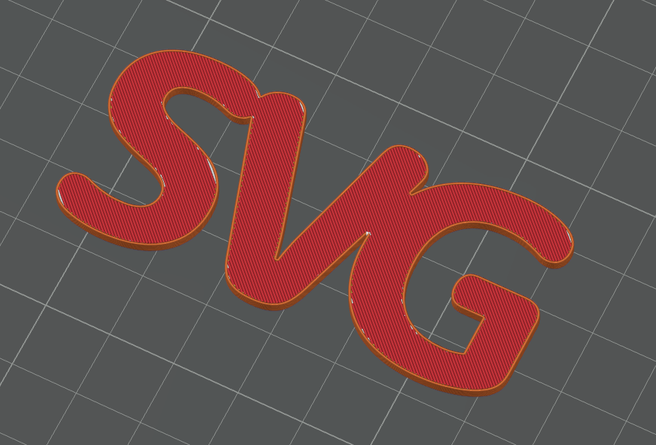

Make your ideas real! Visit our Maker Studio and learn how to laser cut, 3D print, solder, use sensors, glue, drill. It is all available at our Maker Studio in House K.

Get started today and meet our [maker experts](../team/team.md) that will support you.

## Modeler Workstation

The Modeler Workstation is our stationary computer in the Maker Studio that allows to create models, and to preapare various kinds of prints.

### Orca Slicer Software

Orca Slicer is your best option to prepare 3D prints.

- [ ] import model in OrcaSlicer
- [ ] use "auto orient" to position model
- [ ] select textured PEI plate for PLA
- [ ] check if model needs support structure
- [ ] assign filament
- [ ] print on one of our printers
- [ ] tag printer with your name

You are of course free to downloard OrcaSlicer on your computer to prepare your print from there.

https://github.com/SoftFever/OrcaSlicer

Install with brew: `brew install orcaslicer`
AUR: `orca-slicer`

### Autodesk Fusion

### Printer/Plotter

### Label Printer QL-820NWBc

Getting Started
This device can print up to 62mm in width. If wider: You might change the orientation of the label in the software to fit the label on the printer.

You can use the printer via Wi-Fi (hpi-studios) and via USB.

Currently these settings are used:

Design and print your label. You can also print multiple labels at once.

Software
Download the Software
MacOS: https://apps.apple.com/de/app/brother-p-touch-editor/id1453365242?mt=12
Windows: https://support.brother.com/g/s/es/inst/de/index.htm?c=de&lang=de&navi=off&comple=on&redirect=on

## 3D Printers

### Bambu A1 Mini (2x)

Use Bambu a1 Mini when you print small objects with a single filament.

### Bambu X1 (2x)

Use Bambu X1x when you print larger objects or objects with up to four different types or filaments.

The Bambu Lab X1c has a build volume of 256 x 256 x 265 mm and usually uses a 0.4mm nozzle.

PLA Warping Issues

The Bambu has a Snakehouse Fan Duct, which is a bit too close to the bed, on the left of the enclosure. If thin/fragile parts are located on the left side of the bed, near to the edge, they might warp due to the fan blowing on it. If that happens disable the AUX Fan and print with open enclosure. 
This might also apply for other printers with a similar fan duct.

### Creality K1 (2x)

Use Creality K1 when you print large objects.

Creality K1 has a build volume of 300 x 300 x 300 mm usually one of them is equipped with a 0.4mm nozzle and the other one with a 0.8mm nozzle.

The Creality printers use Klipper firmware [Official Documentation] (https://www.klipper3d.org/Overview.html)
You can access the printers via webinterface.
IP left printer (0.8 nozzle): https://172.22.0.254:4408 
IP right printer (0.4 nozzle) https://172.22.3.249:4408

#### Connect OrcaSlicer to Creatly K1 with pure Klipper

You can get the IP address of your Creatly K1 by going to the printer menu and selecting `Settings` and then `Network`.
Make sure your PC is connected to `hpi_studio` WiFi.
Enter the IP Address like shown in the image above and click `Test`. If the test is successful you can click `Connect` and start printing. After slicing you can click `Print` to start printing.

#### Web Interface of the Creality K1
Make sure your PS is connected to `hpi_studio` WiFi.
Select `Settings` and then `Network`. Then enter the IP Address in your browser. Make sure to append `4408` as port. Example: 

### Prusa XL

Use Prusa XL when you print large objects and / or objects with multiple filament types.

#### Printing with Vector Files
It's possible to import SVG files into the slicing software, give them a thickness (extrude) and 3d print them.
This works in Pruse SLicer, Orca Slicer & Bambu Studio.

Import your SVG file, the printer will directly show an extruded version with a height of 10mm.
For creating small signs set Z-height to 2mm (uncheck uniform scale) and adjust XY scale as needed.

sliced SVG:

## Laser Cutter Workstation

The Laser Cutter Workstation is located in the small Maker Studio next to the Trotec Laser Cutter.

### Getting Started

Please contact our team to participate for a mandatory introduction in the machine and the software. The succesful participation allows you to use the laser cutter afterwards.

### Ruby Software

...

## Electronic Workstation

The Electronic Workstation is located in the Maker Studio. It offers various tools to measure and solder electronic parts.

### Soldering Station

We have 6 soldering stations you can use after a mandatory introduction.

### Multimeter

### Microscope